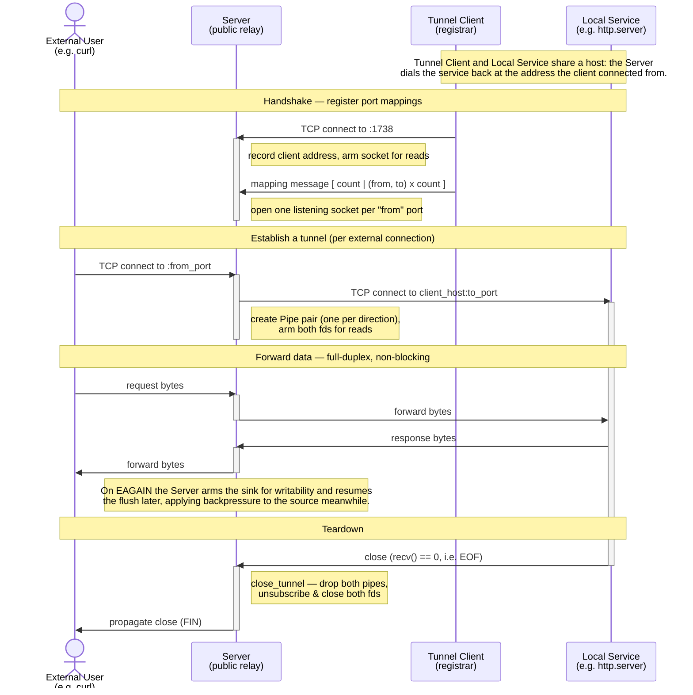

# reverse-tunnel

A small reverse TCP tunnel: a public server exposes a service running on a
private client host to the outside world. The client registers port mappings
with the server; the server then listens on the public ports and relays every
connection through to the client's local service.

## How it works

The tunnel client opens a single control connection to the server and sends the
port mappings it wants. For each `from` port the server opens a public
listening socket. When an external user connects, the server dials the client
host back on the corresponding `to` port and splices the two sockets together,
copying bytes in both directions until either side closes.

> Note: the tunnel client is only involved in the initial handshake. The data
> path is `external user <-> server <-> local service`, so the server connects
> directly to the client host's `to` port, so that host must be reachable from
> the server at that address.



## Building

```bash
cmake -B build
cmake --build build
```

This produces `build/src/server/server` and `build/src/client/client`.

## Running

### Server

The server listens for tunnel clients on port 1738 and needs no arguments:

```bash
./build/src/server/server
```

### Client

The client takes the server's address as a positional argument, plus the port
mappings to register. Each mapping is `<from>:<to>`, where `<from>` is the
public port the server should listen on and `<to>` is the port of the service
on the client host.

Inline list (comma-separated):

```bash
./build/src/client/client <server-addr> -l "80:8080,22:2222"
```

From a file (one `<from>:<to>` mapping per line, see
[`examples/mappings.txt`](examples/mappings.txt)):

```bash
./build/src/client/client <server-addr> -f examples/mappings.txt
```

## Quick demo

Run everything on one machine using Python's built-in HTTP server as the local
service:

```bash
# 1. a local service on port 8000
python3 -m http.server 8000

# 2. the tunnel server (public relay)
./build/src/server/server

# 3. expose it publicly on port 8080 -> local 8000
./build/src/client/client 127.0.0.1 -l "8080:8000"

# 4. reach the local service through the tunnel
curl http://127.0.0.1:8080/
```

## Protocol

Immediately after connecting, the client sends one mapping message. All fields
are 16-bit unsigned integers in network byte order:

| Field         | Size                                 | Description                    |
| ------------- | ------------------------------------ | ------------------------------ |
| `count`       | 2 bytes                              | number of mappings that follow |
| `from` / `to` | 2 bytes each, repeated `count` times | one public/local port pair     |

The data that flows afterwards is opaque — the tunnel is byte-transparent and
does not inspect or frame it.

## Design notes

- Event-driven, non-blocking I/O: A `SocketMonitor` wraps two `epoll`
  instances (one for read interest, one for write) in edge-triggered,
  one-shot mode and feeds ready-socket events into a queue.
- Worker pool: A small pool of worker threads pulls events off that queue
  and handles them, so no thread is ever parked on a blocking socket call.
- Pipes: Each tunnel is a pair of one-way `Pipe`s (source -> sink). Reading
  and writing are symmetric, so both directions share the same forwarding code.
- Backpressure: When a sink can't accept more (`EAGAIN`), the server stops
  reading from that pipe's source and waits for the sink to become writable,
  rather than buffering without bound.
- Teardown: A `recv()` of 0 (EOF), a hang-up, or an error tears the whole
  tunnel down: both pipes are dropped, both sockets are unsubscribed and
  closed, and the close is propagated to the far end.
